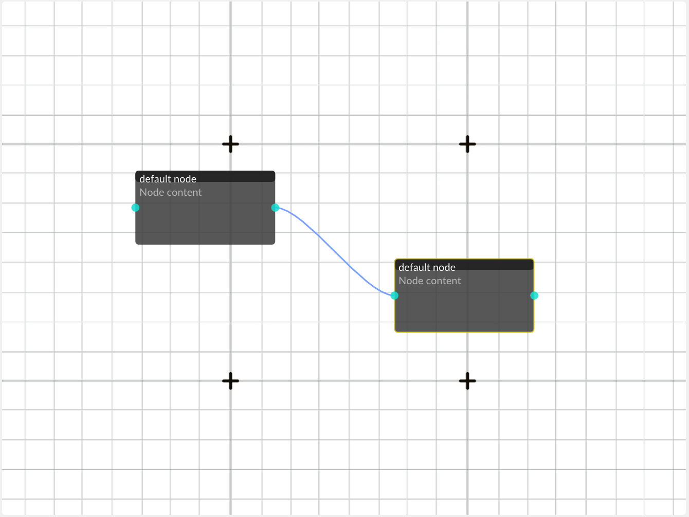

# 🧩 The Node Editor App

Hello everyone!  
This project aims to create a **flexible**, **customizable**, and **reusable visual scripting editor**.  
It is built on top of a private framework I’m actively developing called **ARC-SDK** — an **event-driven modular application framework**.

---

## 🎯 Goals

1. **Script Editor App**  
   A dedicated application that provides all UI elements required to create and edit scripts.  

2. **Runtime Compiler**  
   A runtime library that can be embedded in external applications to **load and run packaged scripts**.  

3. **Extension Support**  
   Enables developers to easily extend the editor’s **structure**, **functionality**, and **visual representation**.

---

## 🧠 Use Cases

- 🧱 **Designer Workflow**  
  A designer uses the editor to create GUI tools → publishes the packaged scripts →  
  a user imports them into an application implementing the runtime compiler →  
  the user can now use those tools directly.  

- 🔌 **Developer Workflow**  
  A developer exposes existing code through a custom plugin →  
  the designer imports that plugin into the editor →  
  new scripting functionality becomes available.  

- ⚙️ **...and more**  
  (Additional use cases planned for future releases.)

---

## ⚡ Current Features

1. **GUI** – built using **ImGui + OpenGL**  
2. **Serialization** – robust save/load system  
3. **Logging Component** – asynchronous log system  
4. **Resource Management Component** – introduces:
   - `Asset` classes with type metadata  
   - basic **Garbage Collection (GC)**  
   - **pointer serialization**  
5. **Input Component** – event-driven, “use-what-you-need” input dispatcher  
6. **Plugin Support** – dynamically load/unload plugins to extend functionality  
7. **Script Support** – powered by **LuaJIT**, enabling:
   - custom UI creation  
   - system and module scripting  
   - access to exposed engine functionality  
8. **...more coming soon**

---

## 🧱 Powered By

**ARC-SDK**  
> A modular C++ framework providing:  
> - Event-driven architecture  
> - Lua integration  
> - Plugin system  
> - Serialization and resource management  
> - ImGui-based GUI tools
